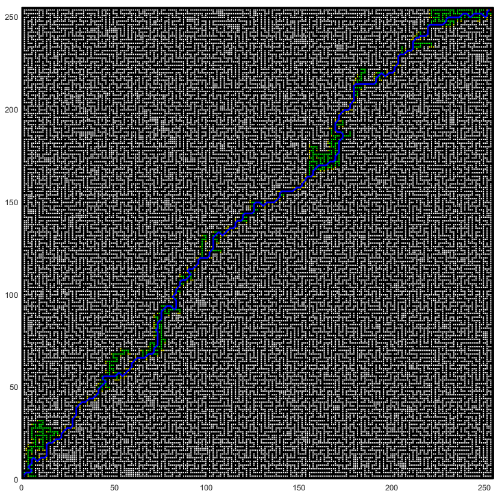

# AstarGENPS

#### Files introduction
The folders are named Astar+map size. These folders contain the MATLAB_map size folder, top_astargnps folder and the recorded experiment results respectively. Among them, MATLAB_map size folder mainly contains MATLAB map generation and implementation of A* algorithm code, saved map data, screenshots of experimental results and MATLAB map generation and communication with FPGA serial port code. The top_astargnps folder is the FPGA project folder.

#### Required equipments
1. A computer that we use is a Dell laptop.
2. An FPGA development board, we use the Xilinx Virtex-7 FPGA VC707 Evaluation Kit, other development boards can be used.
   

This is the development board we use.
3. A data line for serial communication.
4. MATLAB 2018b and above, other versions should work as well.
5. Vivado 2018.3 and above.

#### Instructions for using the programs

1. Some MATLAB programming language and Verilog HDL are required.
2. First open the Vivado project file, download the bitstream file to the FPGA, set the trigger conditions for the signals detected by the ILA and run it to wait for the trigger.
3. Then open the corresponding MATLAB program and run it.
4. Waiting for some time, MATLAB will plot the result and give the time consumed, and the time consumed by the FPGA can be calculated by Vivado's ILA.
5. Because MATLAB draws large maps with long time, and some experiments only need to get the time consumption of the algorithm does not need to observe the planning results, in order to save time the code of drawing is commented out, if you want to observe the final planning results, you can cancel the comments.

#### Some unimportant experimental results are shown

The experimental results in the paper can be found in the respective folders, and some of the results obtained during the implementation are shown here.

This is the planning result of 64*64 map.

These are the planning results for 128*128 maps, and all nodes that have been traversed are also marked in green in these maps.

This is the planning result of the 256*256 map, and all nodes that have been traversed are also marked in green in the figure.

